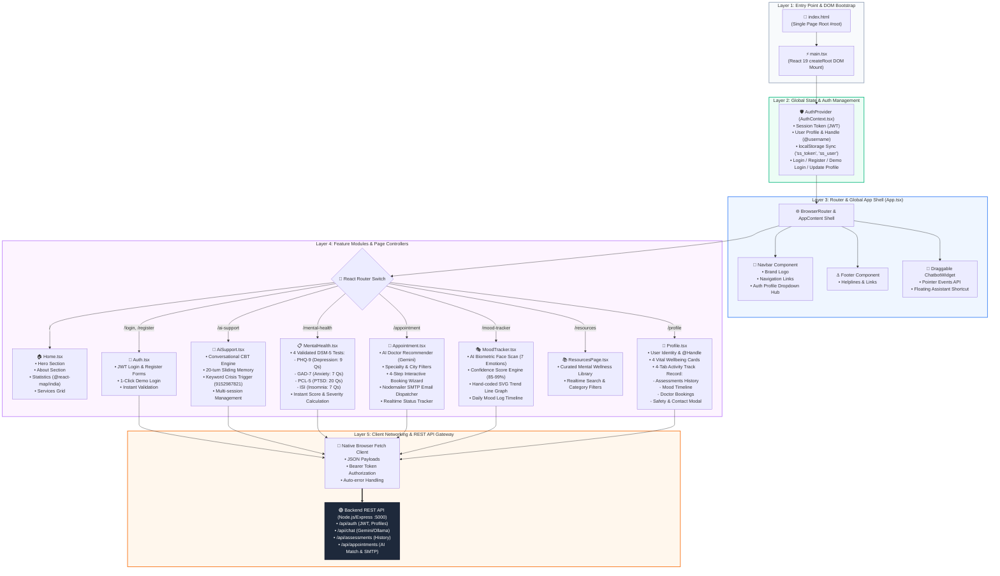

# 🏗️ SoulSpace — Frontend Architecture Flowchart
### Technical Blueprint & System Design (React 19 + TypeScript + Vite)

---

## 🧭 Complete Frontend Architecture Flowchart (Mermaid)

---

## 🏛️ The 5-Layer Frontend Architecture (PPT Breakdown)

### 1. Entry & Runtime Bootstrap (`main.tsx` + `index.html`)
- **Single Page Application (SPA)** root mounted on `#root`.
- **React 19 + TypeScript** runtime with strict type safety.
- **Vite 8** with HMR (Hot Module Replacement) and optimized bundling.

### 2. Global State & Security Context (`AuthContext.tsx`)
- **Centralized Session State**: Stores active user object, unique `@username`, and JWT bearer token.
- **Local Storage Persistence**: Rehydrates credentials (`ss_token`, `ss_user`) on refresh.
- **Stateless Verification**: Seamless login, registration, 1-click demo login, and live profile updates.

### 3. Application Shell & Navigation Hub (`App.tsx` + `Navbar.tsx`)
- **Declarative Client-side Routing**: Managed by `react-router-dom` v7.
- **App Shell**: Top sticky `Navbar` with dynamic auth profile dropdown, responsive mobile drawer, dynamic `Footer`, and floating draggable `ChatbotWidget` (powered by Pointer Events API).

### 4. Modular Feature Pages & Sub-Systems
| Module | Component | Key Responsibilities |
|--------|-----------|----------------------|
| **Home** | `Home.tsx` | Landing experience, India SVG interactive choropleth map (`@react-map/india`), clinical overview. |
| **AI Support** | `AiSupport.tsx` | Empathetic CBT chatbot, 20-turn sliding memory, 20+ keyword crisis detection with instant helpline triggers. |
| **Mental Health** | `MentalHealth.tsx` | 4 DSM-5 clinical screeners (PHQ-9, GAD-7, PCL-5, ISI) with instant scoring and recommendations. |
| **Appointment Concierge** | `Appointment.tsx` | Gemma-2B-3BrainCell specialist recommendation, 3-step wizard, Nodemailer SMTP patient/doctor dispatch. |
| **Mood Tracker** | `MoodTracker.tsx` | Biometric AI facial expression scanner (7 emotions), confidence indicator, hand-crafted SVG line trend chart. |
| **Profile Hub** | `Profile.tsx` | User identity card, unique handle `@username`, 4-tab clinical & mood track records, live edit modal. |
| **Resources** | `ResourcesPage.tsx` | Mental health directory with category filter and search. |
| **Auth** | `Auth.tsx` | Secure login, registration, and 1-click Demo mode. |

### 5. Client Networking & Gateway Layer
- **Native Fetch API**: Standardized JSON communication with the Express backend (`http://localhost:5000/api`).
- **Authorization Interceptor**: Automatic `Bearer <JWT>` header injection for protected endpoints.
- **Resilience**: Client-side error boundaries, toast notifications, and retry logic for high API availability.

---

## 🎤 30-Second Elevator Pitch for Judges (Presentation Script)

> *"SoulSpace’s frontend is engineered with **React 19 and TypeScript**, built for speed, privacy, and clinical reliability. It features a clean **5-layer modular architecture**: from our **Auth & Session Context** to a **responsive App Shell**, branching into **7 core modules** including AI Therapy Chat (powered by Team 3BrainCell's Fine-Tuned Gemma 2B Clinical Model), DSM-5 Screeners, and Biometric Mood Tracking. Everything communicates through a secure **JWT-authenticated REST gateway** connected to our Node.js AI backend. Zero heavy third-party UI libraries — fully custom, ultra-fast, and accessible."*
